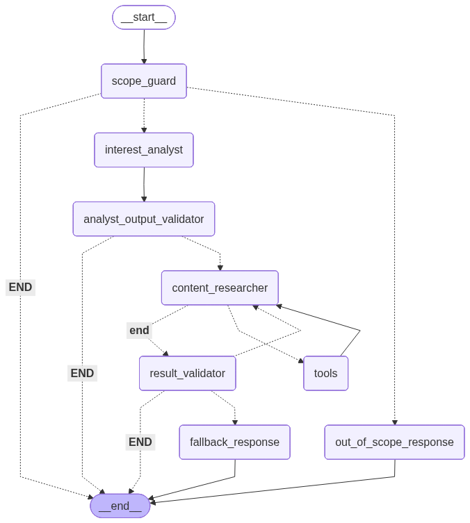

# Moviebot

## Overview
Moviebot is an LLM-based movie and TV recommendation assistant.

Fullstack MVP (FastAPI + React + Supabase, locally via Docker Compose).

## POC
- Backend: LangGraph
- Frontend: Gradio
- Current entry point: `gradio frontend/gradio/app.py`

## Fullstack MVP
- Backend: FastAPI + LangGraph
- Frontend: React/TypeScript (shadcn/Tailwind)
- Auth/DB: Supabase (including RLS)
- End-to-end via Docker Compose

## MVP Decisions
- Supabase Auth + JWT verification in the backend on every request
- Persistence stores all user inputs and bot responses append-only (no overwrites)
- Exactly 1 active conversation per user

## APIs Used (POC)
- LLM/Search: Google Gemini with Google Search grounding
- Metadata/Provider: TMDB
- Tracing: LangSmith

## How It Works (POC)
- InterviewAgent
- ContentResearcher (tool usage)
- State + Memory/Checkpoint
- Session handling

### Graph

## Feature Status (POC)
- Clarification Questions ✅
- Streaming provider filter ✅
- Payment type filter ✅
- Movie/series as filter criterion ✅
- Single-provider optimization in search ✅
- Improved fallback message ✅
- Out-of-scope handling ✅
- Public broadcaster search (ARD/ZDF) ✅
- Direct links to streaming providers (open)
- Cover artwork (open)

## Start Commands
- POC: `gradio frontend/gradio/app.py`
- Backend (target path): `uvicorn main:app --reload`
- Frontend (target path): `npm run dev`
- Docker: `docker compose up`

## Task 1 Runbook (Local Infrastructure)

### Services Included in `docker-compose.yml`
- App: `backend` on port `8000`, `frontend-web` on port `3000`
- Minimal Supabase + Studio: `supabase-db`, `supabase-auth`, `supabase-rest`, `supabase-meta`, `supabase-kong`, `supabase-studio`
- Migrations: `supabase-migrations` (one-shot, non-destructive; only new SQL files)

The entire local stack runs exclusively via `docker compose`.

### Start
1. `docker compose up -d`
2. `docker compose ps`
3. `docker compose logs --tail=100`

### Restart Flow (Reproducible)
1. `docker compose down`
2. `docker compose up -d`
3. If needed, start with a fresh volume: `docker compose down -v && docker compose up -d`

### Health/Status Checks
- Backend reachable: `curl http://localhost:8000`
- Check container status: `docker compose ps`
- Supabase API reachable: `curl http://localhost:54321/rest/v1/`
- Supabase Studio reachable (with login): `http://localhost:54321`

### Note for Task 4
The `frontend-web` service intentionally stays active as a placeholder in Task 1. As soon as `frontend/web/package.json` exists, the same service automatically starts the real web app.

### Required ENV Variables (MVP)
- `GOOGLE_API_KEY`
- `GOOGLE_MODEL_ANALYST`
- `GOOGLE_MODEL_RESEARCHER`
- `GOOGLE_SEARCH_MODEL`
- `TMDB_BEARER`
- `SUPABASE_URL`
- `SUPABASE_ANON_KEY`
- `SUPABASE_SERVICE_ROLE_KEY`
- `SUPABASE_JWT_SECRET`
- `SUPABASE_DASHBOARD_USERNAME`
- `SUPABASE_DASHBOARD_PASSWORD`
- `BACKEND_API_URL`
- `FRONTEND_WEB_URL`

### Verification
1. `.env.example` contains all required variables.
2. After `cp .env.example .env`, Compose still starts without additional implicit defaults.

## Runbook

### E2E Runbook (First Start)
1. Fill `.env` with the required keys/secrets
2. Start the full stack: `docker compose up -d --build`
3. Check runtime status: `docker compose ps`
4. Check backend: `curl http://localhost:8000/health`
5. Check Supabase API: `curl http://localhost:54321/rest/v1/`
6. Open Studio: `http://localhost:54321` (Kong Basic Auth)
7. Create a Supabase user and sign in via frontend

### Create Test User

1. Open Supabase Studio (`http://localhost:54321`)
2. Auth → Users → create user manually
3. Set email + password for test user

### E2E Runbook (Stop/Start with Compose)
1. Stop and remove all containers cleanly:
	- `docker compose down`
2. Start all containers again:
	- `docker compose up -d`
3. Check status:
	- `docker compose ps`

Optional full reset (including volumes/data):
- `docker compose down -v`
- `docker compose up -d`

For Updates of Supabase Setup / Database
- `docker compose run --rm supabase-migrations`
